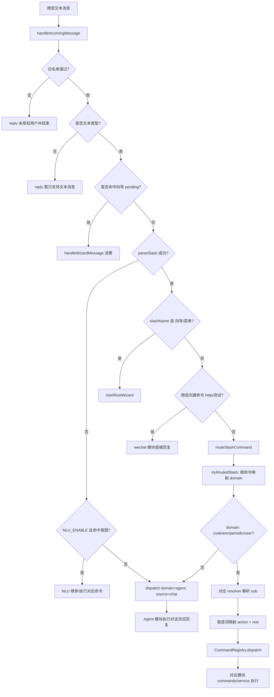
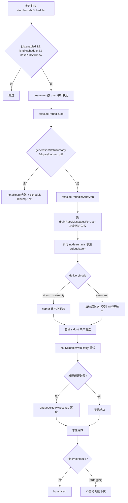

# wechat-agent-bot

基于 [wechatbot / iLink](https://www.npmjs.com/package/@wechatbot/wechatbot) 的微信私聊机器人：将消息交给本机 **Cursor Agent**（`agent` CLI）流式回复，并带有**按 CRON（上海时区）调度的周期 Node 脚本任务**、**环境变量远程注入**、**已登记本地/SSH 项目的 build.sh 编译与修复**、**Steam 好友状态监控**等扩展能力。

- **运行环境**：Node.js **≥ 22**
- **配置入口**：项目根目录 `.env`（可参考 [`.env.example`](./.env.example)）；运行时数据默认落在 **`DATA_DIR`**（默认 `./data`，各 `*_PATH` 可单独覆盖）
- **多平台**：微信 + QQ（可选）共用业务模块；**会话管理**（`src/sessionManager/`）登记 `userId` 与平台投递通道；周期任务、Steam 监控等**主动推送**也可按 `userId` 投至 QQ（无需用户先发消息）

## 快速开始

```bash
npm install
cp .env.example .env
# 编辑 .env：至少配置微信侧存储目录、允许的用户、Agent 命令等
npm run dev
```

开发模式下 `npm run dev` 会默认打开 `WECHAT_TERMINAL_IO=1`（在 `main.ts` 中按 `npm_lifecycle_event=dev` 自动设置，可用 `WECHAT_TERMINAL_IO=0` 关闭），终端会按 `INFO  [wx-io]` 格式打印收发的脱敏摘要。

生产运行建议先构建再启动：

```bash
npm run build
npm start
```

## Web 控制台（毛玻璃管理面板）

浏览器内完成本项目的设置与运维，**默认随主进程启动**，仅监听本机。完整设计见 [docs/web-admin-design.md](./docs/web-admin-design.md)。

- **后端**：内嵌主进程的 Hono HTTP 层（`src/web/`）+ core 服务层（`src/core/`），薄路由调用既有模块。
- **前端**：React + Vite + Tailwind + 毛玻璃设计（`web/`，构建产物 `web/dist` 由后端托管）。
- **访问与鉴权**：默认绑 `127.0.0.1:8787`；登录口令与微信 `/用户 验证` **同源**（`ADMIN_LOGIN_PASSWORD` 或 `data/admin-auth.json`）。首次无口令时在首屏设置。会话为 HMAC 签名的 httpOnly cookie（密钥存 `data/web-secret`）。

```bash
# 开发：两个进程（后端热重载 + 前端 Vite，自动代理 /api）
npm run dev                 # 起主进程（含 Web 后端 :8787）
npm run web:install         # 首次：装前端依赖
npm run web:dev             # 起前端 :5173（开发时访问这个）

# 生产：构建前端后随 npm start 一起托管
npm run web:build           # 生成 web/dist
npm start                   # 访问 http://127.0.0.1:8787
```

已实现（P0–P5，导航全部为真实功能）：登录/首屏设密、实时仪表盘、**全部 `.env` 的分类表单 + 原文双视图**（密钥脱敏、写前自动备份、「即时/热加载/需重启」标注与重启）、⌘K 命令面板、深浅主题；**平台**：微信扫码登录（二维码 SSE 推送）、QQ 凭证校验 + 热连接/断开、出站队列补发/清空；**自动化**：周期任务列表/新建（**网页直接写 run.mjs，零 token**）/CRON 下次触发预览/脚本编辑（保存即 node --check）/**流式试跑（SSE）**/启停/改 CRON/删除、Steam 监控状态与好友快照；**代码项目**：登记列表/设默认/删除（构建·修复 SSE 待续）；**智能**：Agent 后端信息 + **流式试跑（SSE）**、NLU 状态 + 试抽槽、别名 CRUD（用户级/全局只读）、记忆（**遗忘曲线可视化** + 档案编辑 + 向量笔记 + 立即巩固）、联网检索状态 + 试搜 + SearXNG 进程启停。**用户**：完整可复制 userId（解决聊天里被截断）、平台徽标、简称/启停、**级联删除**（环境注入/代码登记/以其为通知对象的周期任务/会话一并清理）、每用户环境注入键值编辑；**系统**：关于/能力开关汇总/**保存并重启**、**日志实时 tail**（SSE，级别过滤/搜索/暂停）、**数据备份/还原**（快照 DATA_DIR 到 data-backups/，还原前自动安全快照）。导航各页均已为真实功能。代码项目的构建·修复 SSE 仍待续。

> 排障：若某页显示「加载失败 not found(404)」，多为后端进程未更新到对应接口——重启机器人进程即可（页面已会显式报错而非空白）。可访问 `http://127.0.0.1:8787/api/ping` 查看后端已挂载的接口清单确认版本。

| 变量 | 默认 | 说明 |
| --- | --- | --- |
| `WEB_CONSOLE_ENABLE` | `1` | `0`=不启动 Web 控制台 |
| `WEB_BIND` | `127.0.0.1` | `0.0.0.0`=局域网可访问（务必用强口令） |
| `WEB_PORT` | `8787` | 监听端口 |

> 重启：面板的「保存并重启」会优雅退出进程，依赖外部守护（PM2 / `node --watch` / 系统服务）拉起；无守护时需手动 `npm start`。

## QQ 机器人（可选）

在 `.env` 中配置 `QQ_BOT_APP_ID` 与 `QQ_BOT_CLIENT_SECRET`（或 `QQ_BOT_TOKEN`），并设 `QQ_BOT_ENABLED=1`；也可在运行时通过 **`/用户 QQ 连接`** 或向导 **用户中心 → 配置 QQ 机器人连接** 写入 `data/qq-bot-config.json` 并热启动 WebSocket。

| 命令 | 说明 |
| --- | --- |
| `/用户 验证 <密码>` | 管理员口令验证 |
| `/用户 登记` | 当前聊天者加入白名单（微信/QQ 通用） |
| `/用户 添加` | 管理员：选择平台（微信扫码 / QQ 登记指引） |
| `/用户 添加 微信` | 生成微信扫码二维码 |
| `/用户 添加 QQ` | 展示 QQ 新用户入网步骤 |
| `/用户 QQ 连接 <AppID> <Secret>` | 配置 QQ **机器人**接入（须先验证；非用户扫码） |
| `/用户 QQ 状态` / `/用户 QQ 断开` | 查看或停止 QQ 机器人连接 |

**凭证校验**：保存 QQ 配置前会请求 QQ 开放平台验证 AppID/Secret；若提示 `fetch failed` 多为本机出网问题，而非 Secret 一定错误。

**WebSocket 鉴权**：关闭码 `4004` 表示鉴权失败，请核对 AppID/Secret 与开放平台沙箱开关；连续失败会暂停自动重连，修正凭证后执行 `/用户 QQ 连接` 或重启进程。一般断线会尝试 **session resume** 再重连。

QQ 与微信并列，共用 `/帮助`、`/用户`、`/向导`。业务 `userId`：微信为原始 ID，QQ 为 `qq:c2c:<openid>`。

## 主要能力

| 能力 | 说明 |
| --- | --- |
| 私聊对话 | **无向导 pending** 时，非斜杠文本走 `runAgentStreaming` 并尽量推流式进度；**在向导中**仅填参，与普通聊天隔离、不走该 Agent 通路 |
| 斜杠命令 | 以 `/` 开头（全角 `／` 会被归一成 `/`），见下表 |
| 自然语言命令（NLU） | `NLU_ENABLE=1` 且配置 `DEEPSEEK_API_KEY` 时，非斜杠文本由 **DeepSeek 对全量命令清单抽槽**；缺参时多轮追问。未命中时**默认继续走 Agent**（`NLU_AGENT_FALLBACK_ON_MISS=0` 则仅提示使用斜杠命令）。请求超时/失败会重试并可能回复「思考中....」。`NLU_STYLE_ENABLE=1` 仅润色填参/消歧话术；**命令结果不润色** |
| 用户白名单 | `ALLOWED_USER_IDS` 非空时仅列表内 `userId` 可用；空则不限 |
| 用户简称 | `/用户 简称 <名称>` 设置全局唯一简称（2～24 字）；管理员 `通知`/`查看`/`删除` 可用简称替代 `userId`；列表与 Agent 上下文会展示简称 |
| 管理员 | 管理员通过 `/用户 验证 <密码>` 后，可执行用户管理、跨用户查看/操作与主动喊话 |
| 用户删除清理 | `/用户 删除` 会移除用户记录，并清理其环境注入、`/代码` 登记、以其为通知对象的周期任务、Cursor `chatId` 与 NLU 填参会话 |
| 会话续聊 | 默认 `CHAT_SESSION_ENABLE=1` 时，为每用户维护 Cursor `chatId`（`--resume`） |
| 周期任务 | Node 读写 `PERIODIC_STATE_PATH`；**schedule** 使用 **5 段 CRON**（`Asia/Shanghai`），作业目录在 `PERIODIC_JOB_ROOT/<任务ID>`，入口默认 `run.mjs` |
| 环境注入 | `/环境 set` 按 `userId` 隔离写入注入 JSON；周期脚本运行时会自动注入所属用户环境变量 |
| 多轮向导 | `/向导` 或 `/菜单` 进入；含**代码**、**周期**、**环境**、**用户中心**子向导；向导内纯文本填参，发「退出」结束 |

## 微信中的命令

| 命令 | 作用 |
| --- | --- |
| `/help` | 简短帮助 |
| `/向导` / `/菜单` | 多步向导：代码 / 周期 / 环境 / 用户中心；向导内纯文本，发「退出」结束 |
| `/周期 help` / `list` / `detail <ID> [path]` | 周期任务帮助、列表、详情 |
| `/周期 create schedule cron <分> <时> <日> <月> <周> [short <名称>] [stdout_nonempty\|every_run] <描述>` | 创建 schedule 任务 |
| `/周期 create trigger [short <名称>] [stdout_nonempty\|every_run] <描述>` | 创建 trigger 任务 |
| `/周期 modify <ID> [cron\|short\|clear-short\|delivery\|agent] ...` / `remove` / `enable` / `disable` / `run` | 修改、删除、启停、执行 |
| `/环境 help` / `list` / `set` / `delete` | 用户级环境变量管理（管理员验证后可 `for <userId>` 跨用户操作） |
| `/代码 help` / `list` / `add` / `default` / `remove` / `config` / `compile` / `fix` | 代码项目管理（管理员验证后可 `for <userId>` 跨用户操作） |
| `/用户 help` / `验证` / `logout` / `登记` / `添加` / `列表` / `简称` / `password` / `喊话` / `通知` / `查看` / `删除` / `共享 …` / `QQ …` | 用户中心：验证、登记、简称、向管理员喊话、管理员通知/查看/删除（会级联清理关联数据；目标可用**简称**或 `userId`） |
| `/别名 添加 <说法> = <命令>` / `列表` / `删除 <说法>` | 教机器人把整句精确说法当某斜杠命令（用户级；非斜杠/非向导时命中，零 token）。也会在「未命中→手动执行命令」后主动建议（回「好」记下） |
| `/记忆 我叫 <名>` / `偏好 <内容>` / `记住 <一句话>` / `列表` / `删除` | 让机器人记住称呼/偏好/事实并注入对话（需 `MEMORY_ENABLE=1`；详见 [docs/vector-plan.md](./docs/vector-plan.md)） |
| `/测试` | 收发通路测试，回复在预设池中变化（`CMD_STYLE_ENABLE=1` 时由 LLM 换花样改写） |

未授权用户会收到「未授权用户」提示（与业务消息一样经统一换行处理）。

## 用户记忆与语义向量（可选，全本地开源，默认关）

非斜杠文本的路由顺序：**斜杠 → 向导/填参 → 精确别名 → 语义别名（向量）→ NLU(DeepSeek) → Agent**。其中后三项可逐级开关：

- **精确别名**（始终可用，零成本）：`/别名` 或 auto-suggest 教它整句对应命令。
- **语义别名 / 语义意图**（`VECTOR_ENABLE=1` + `INTENT_SEMANTIC_ENABLE=1`）：用本地 **bge-small-zh** 嵌入找近义别名，"测一下"也能命中"测试"教过的命令，并省一次 DeepSeek 调用。
- **用户记忆**（`MEMORY_ENABLE=1`）：结构化档案（称呼/偏好，每轮注入）+ 情景笔记（`VECTOR_ENABLE=1` 时向量召回）；`MEMORY_AUTO_EXTRACT=1` 可从对话自动抽取事实（费 token，默认关）。

嵌入模型 `Xenova/bge-small-zh-v1.5` 经 `@huggingface/transformers` **本地推理**（首次自动下载到 `EMBED_CACHE_DIR`，可 `EMBED_OFFLINE=1` 纯离线），数据不出本机。完整设计与阶段见 [docs/vector-plan.md](./docs/vector-plan.md)，全部 env 见 [`.env.example`](./.env.example)。

**联网检索（grounding，可选）**：实时类问题（天气/新闻/股价…）或以「搜：」开头时，先查本地自建 [SearXNG](https://github.com/searxng/searxng) 再让模型据此回答并附来源，避免编造。一键安装 `npm run searxng:setup`（venv+pip 装到 `searxng/`），设 `WEBSEARCH_ENABLE=1 SEARXNG_AUTOSTART=1` 即随工程启动。详见 [docs/searxng.md](./docs/searxng.md)。

## 消息交互流程（路由 + 周期发送）

下面按“微信入站”和“周期任务出站”两条链路梳理。

### 1) 微信入站如何路由到模块、如何把消息映射为模块关键字



关键点：

- 入站文本在 `handleIncomingMessage` 内经 **`runInboundChain`**（`src/handler/inboundChain.ts`）顺序尝试：NLU 填参态 → 斜杠 → 向导/NLU → Agent 等（`src/handler/steps/`）。
- 根命令映射（模块路由）在 `src/wizard/slashCatalog.ts`：`/代码|/code -> code`、`/周期|/periodic -> periodic`、`/环境|/env -> env`、`/用户|/user -> user`。
- `parseSlash` 在 `src/commands/slashParse.ts`：先统一全角斜杠，再得到 `name + rest`。
- 模块关键字映射在 `src/modules/*/keywords.ts`：`resolvePeriodicAction` / `resolveCodeAction` / `resolveEnvAction` / `resolveUserAction` 会把 `sub` 首词（如 `create`、`list`）解析为 `action`，剩余部分作为 `rest` 传给模块服务层。
- 如果不是斜杠命令（且不在向导态）：若 `NLU_ENABLE=1`，先 `tryDispatchNluText`（DeepSeek 全量 manifest 抽槽 → 命令或填参追问）；未命中时默认走 `agent`（可由 `NLU_AGENT_FALLBACK_ON_MISS` 改为仅提示斜杠）；NLU 关闭时直接走 Agent。

### 2) 周期触发后如何发送 stdout（是否发送、失败落盘补发）



关键点：

- 调度入口在 `src/plugins/periodic/sched.ts`，只自动扫描 `kind=schedule`；`trigger`（触发式）任务默认不参与定时扫描，通常通过 `/周期 run <ID>` 触发一次执行。
- 发送策略在 `src/plugins/periodic/scriptRunner.ts`：
  - `stdout_nonempty`：stdout 空时不发任何业务消息。
  - `every_run`：stdout 空时也会发“本轮无输出”占位消息（用于确认“任务确实跑了”）。
- 推送规则：stdout 作为单条消息发送；超长按 `PERIODIC_SCRIPT_MAX_STDOUT_CHARS` 截断。
- 失败可靠性：
  - 单条发送失败会重试（指数退避）；重试与入队过程默认**静默**（降为 `debug` 级，`LOG_LEVEL=debug` 才打印），不刷终端。
  - 仍失败则写入落盘队列（与微信/QQ 出站**共用** `OUTBOUND_RETRY_QUEUE_PATH`，默认 `data/outbound-retry-queue.json`；旧 `periodic-retry-queue.json` 会自动迁移）。
  - 队列为**每用户上限 10 条的循环队列**（`OUTBOUND_QUEUE_MAX_PER_USER`，超出丢最旧），避免长期失败时无限堆积。
  - 用户回消息或下次任务执行前先补发队列；补发成功即删盘。超过最大重试次数（`OUTBOUND_QUEUE_MAX_ATTEMPTS`，默认 5）或存活超过 `OUTBOUND_QUEUE_TTL_MS`（默认 1 天）的项会被**静默清除**。
  - 脚本执行失败默认不主动推送；仅手动执行 `/周期 run <ID>` 时会在当前会话回复失败摘要。

## 消息换行与展示

微信部分客户端对**单行 `\n`** 会压成空格。本项目通过以下方式提高多行展示稳定性：

- **`joinWxParagraphs`**：段与段之间使用 **`\n\n`**（如 `/周期 详情` 的 `formatJobDetail`）
- **`joinWxLines`**：与 `/环境 help` 相同，每行末尾补 `\n` 后再用 `\n` 拼接
- **`notify/channel`**：对 `replyText` / `replyPlain` / `send` 的文本在发出前做 **`finalizeWxOutbound`**，并令 `formatOutboundLines` 生成的多行 tone 行之间为 **`\n\n`**
- **`/周期 列表` 中的 CRON**：出站将半角 `*` 换为全角 `＊`，避免微信客户端误解析；复制到命令行前请改回半角星号

## 网络与代理（`Poll error` / `fetch failed`）

微信 SDK（`@wechatbot/wechatbot`）通过 **Node 内置 `fetch`** 访问 `link.weixin.qq.com` / iLink 接口。日志里出现 **`Network error: fetch failed`** 表示这一次 HTTPS 请求在底层失败（DNS、超时、连接被重置、当前网络访问不到腾讯网关等），**通常是真实网络问题**，而不是与本项目其它定时任务「进程冲突」。

若换网络后必须走本地代理（例如 Clash / V2Ray 的 HTTP 端口 **`http://127.0.0.1:10808`**）：

1. **确认代理软件已启动**，且该端口提供 **HTTP 代理**（与 Steam 监控用的 `STEAM_MONITOR_PROXY_URL` 不是同一套逻辑；后者只影响 Steam 插件）。
2. 在 `.env` 中设置 **`HTTPS_PROXY` / `HTTP_PROXY`**（指向 **HTTP 代理端口**，如 Clash 的 mixed 端口；纯 SOCKS 端口勿写成 `http://`）。
3. **启动后** 日志应出现 `全局 fetch 已绑定 undici EnvHttpProxyAgent`；本进程会强制让微信 SDK 的 `fetch` 走上述代理（不依赖 `NODE_USE_ENV_PROXY` 是否生效）。若仍像直连，检查代理是否监听、协议是否匹配，或设 `WECHATBOT_FETCH_USE_PROXY=0` 排除误配。
4. 仍失败时：浏览器打开 `https://ilinkai.weixin.qq.com` 看是否完整加载；或使用 **TUN / 系统 VPN**。

详见 [`.env.example`](./.env.example) 内「出站代理」注释。

## 环境变量（摘要）

更全列表见 [`.env.example`](./.env.example)。常用项：

- **数据根目录**：`DATA_DIR`（默认 `./data`；未单独设置 `*_PATH` 时，会话/用户/周期/注入等均在其下）
- **Agent**：`AGENT_CMD`、`AGENT_ARGS_JSON`、`AGENT_INVOKE_MODE`、`AGENT_TIMEOUT_MS`、`AGENT_MAX_RUNTIME_MS`、`AGENT_IDLE_TIMEOUT_MS`、`AGENT_OUTPUT_MODE`、`AGENT_FORCE_STREAM_JSON`、`AGENT_NO_AUTO_PRINT_FLAG`
- **Agent 后端**：`AGENT_BACKEND`（`cli`=spawn `cursor-agent` 子进程，默认；`sdk`=`@cursor/sdk` 本进程内 local 模式，去掉 CLI/stdout 解析，**需 Node ≥ 22.13**）。设 `sdk` 时必填 `CURSOR_API_KEY` 与 `AGENT_MODEL`（本地 agent 必须指定模型，如 `composer-2.5`；可用 `Cursor.models.list()` 查询）。两后端对外接口一致，切换无需改业务代码
- **出站重试队列**：`OUTBOUND_RETRY_QUEUE_PATH`、`OUTBOUND_QUEUE_MAX_PER_USER`（默认 10）、`OUTBOUND_QUEUE_MAX_ATTEMPTS`（默认 5）、`OUTBOUND_QUEUE_TTL_MS`（默认 1 天）、`OUTBOUND_QUEUE_DRAIN_MAX`
- **微信 SDK**：`WECHATBOT_STORAGE_DIR`、`WECHATBOT_LOG_LEVEL`、`WECHATBOT_BASE_URL`（可选）
- **安全与多用户**：`ALLOWED_USER_IDS`、`USER_STORE_PATH`、`ADMIN_LOGIN_PASSWORD`、`ADMIN_AUTH_PATH`
- **会话**：`SESSION_STORE_PATH`、`CHAT_SESSION_ENABLE`
- **NLU**：`NLU_ENABLE`、`DEEPSEEK_API_KEY`、`NLU_AGENT_FALLBACK_ON_MISS`、`NLU_STYLE_ENABLE`、`NLU_LLM_MODEL`、`NLU_LLM_RETRY_MAX`、`NLU_LLM_ATTEMPT_TIMEOUT_MS`、`NLU_CONFIDENCE_MIN`、`NLU_INTERRUPT_MIN`、`INTERACTION_STATE_PATH`
- **Steam 好友监控**：`STEAM_WEB_API_KEY`、`STEAM_MONITOR_STEAM_ID`、`STEAM_MONITOR_NOTIFY_USER_ID`、`STEAM_MONITOR_PROXY_URL`、`STEAM_MONITOR_INTERVAL_MS`（状态变更通知会去重：如上线并进游戏只推游戏、下线优先于退游戏）
- **周期任务**：`PERIODIC_STATE_PATH`、`PERIODIC_JOB_ROOT`、`PERIODIC_SCAN_MS`、`PERIODIC_SCRIPT_TIMEOUT_MS` 等
- **日志与调试**：`LOG_LEVEL`、`WECHAT_TRACE_IO`、`WECHAT_TERMINAL_IO`
- **出站代理（微信 fetch）**：`HTTPS_PROXY`、`HTTP_PROXY`、`NO_PROXY`；`WECHATBOT_FETCH_USE_PROXY=0` 可关闭程序内强制绑定（见上文）
- **展示**：`WX_EMOJI_STYLE`（`full` / `minimal` / `off`）、`WX_AGENT_PROGRESS_MAX_CHARS`
- **/代码 模块**：`CODE_PROJECTS_PATH`、`CODE_PROJECT_ROOT_ALLOWLIST`、`CODE_ARTIFACT_GLOB`、`CODE_BUILD_TIMEOUT_MS`（与 `COMPILE_TIMEOUT_MS`、`COMPILE_MAX_SEND_MB` 等并列，见 [`.env.example`](./.env.example)）
- **多轮向导**：`WIZARD_STATE_PATH`、`WIZARD_TTL_MS`

## 目录与数据

默认根目录为 **`DATA_DIR`**（`./data`）。下表路径均相对于该根目录，除非环境变量另行指定。

| 路径 | 用途 |
| --- | --- |
| `data/.wechatbot/` | 微信机器人登录与 SDK 状态（默认，可改 `WECHATBOT_STORAGE_DIR`） |
| `data/sessions.json` | 用户 → Cursor `chatId` 映射（可改 `SESSION_STORE_PATH`） |
| `data/periodic-state.json` | 周期任务元数据 |
| `data/periodic-jobs/<id>/` | 各任务工作区与 `run.mjs` 等（启动时会将旧 `run.py` 自动迁移为 `run.mjs` 并删除 Python 文件；复杂脚本由 Agent 后台改写） |
| `data/injected-env.json` | 用户级环境注入键值（按 `userId` 隔离；可改 `INJECTED_ENV_PATH`） |
| `data/code-projects.json` | `/代码` 已登记项目（可改 `CODE_PROJECTS_PATH`） |
| `data/users.json` | 多用户启用状态与**简称**（可改 `USER_STORE_PATH`） |
| `data/admin-auth.json` | 管理员口令持久化（可改 `ADMIN_AUTH_PATH`） |
| `data/wizard-state.json` | 多轮向导 pending（可改 `WIZARD_STATE_PATH`） |

## 脚本

| 命令 | 说明 |
| --- | --- |
| `npm run dev` | `tsx watch` 热重载主进程 |
| `npm run build` | `tsc` 编译到 `dist/` |
| `npm start` | 运行 `node dist/main.js` |
| `npm test` | Vitest |

## 许可与依赖

- 业务代码以项目内 `package.json` 与许可证为准（若未单独声明，请自行补充）。
- 核心通信依赖 `@wechatbot/wechatbot`，Agent 侧依赖本机已安装的 Cursor **`agent`/`cursor-agent`** 可执行环境。
- 周期任务 CRON 校验与下次触发计算均使用 **`cron-parser`**（随 `npm install` 安装）。
